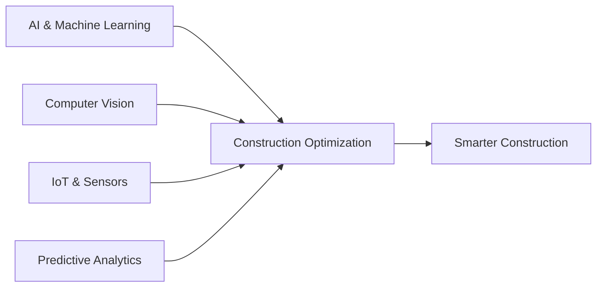

# 🏗️ Digital Construction

### Transforming the Built Environment with AI

---

**Building the Future of Construction Through Artificial Intelligence**

## 🎯 About Us

Digital Construction is at the forefront of revolutionizing the construction industry through innovative AI-powered solutions. We leverage cutting-edge artificial intelligence and machine learning technologies to optimize project management, enhance safety, and drive efficiency across the entire construction lifecycle.

### 🌟 Our Mission

To empower construction professionals with intelligent tools that transform complex challenges into streamlined solutions, making construction projects safer, faster, and more cost-effective.

## 💡 What We Do

<table>
<tr>
<td width="50%">

### 🤖 AI-Powered Solutions
- **Intelligent Project Management** - Automate workflows and optimize resource allocation
- **Predictive Analytics** - Forecast risks and prevent costly delays
- **Smart Scheduling** - Generate optimal construction sequences

</td>
<td width="50%">

### 📊 Digital Innovation
- **Real-Time Monitoring** - Track progress with computer vision and IoT
- **Safety Compliance** - AI-driven hazard detection and prevention
- **Data-Driven Insights** - Transform construction data into actionable intelligence

</td>
</tr>
</table>

## 🔧 Technology Focus

### Core Technologies
- 🧠 **Artificial Intelligence** - Deep learning models for construction intelligence
- 👁️ **Computer Vision** - Automated site monitoring and progress tracking
- 📈 **Predictive Analytics** - Risk assessment and project forecasting
- 🔗 **Integration** - Seamless connectivity with existing construction tools

## 🚀 Key Benefits

| Benefit | Impact |
|---------|--------|
| ⚡ **Increased Efficiency** | Reduce manual work and accelerate project delivery |
| 💰 **Cost Savings** | Minimize waste and optimize resource utilization |
| 🛡️ **Enhanced Safety** | Real-time hazard detection and compliance monitoring |
| 📊 **Better Decisions** | Data-driven insights for proactive project management |
| 🤝 **Improved Collaboration** | Streamlined communication across all stakeholders |

## 🌐 Industry Impact

The construction industry is undergoing a digital transformation, and we're leading the charge. Our solutions address critical pain points:

- **Project Delays** → Predictive scheduling and risk management
- **Budget Overruns** → AI-powered cost forecasting and optimization
- **Safety Incidents** → Intelligent monitoring and real-time alerts
- **Communication Gaps** → Integrated platforms for seamless collaboration
- **Manual Processes** → Automated workflows and smart documentation

## 📚 Our Repositories

Explore our open-source projects and contributions to the construction technology ecosystem. We believe in collaborative innovation and sharing knowledge to advance the entire industry.

## 🤝 Get Involved

We're always looking to collaborate with:
- 🏢 **Construction Companies** - Partner with us to transform your operations
- 👨‍💻 **Developers** - Contribute to our open-source projects
- 🎓 **Researchers** - Join us in advancing construction AI
- 🌟 **Innovators** - Share ideas and build the future together

## 📬 Connect With Us

**Ready to revolutionize your construction projects?**

---

Building Tomorrow's Infrastructure Today | © 2024 Digital Construction

